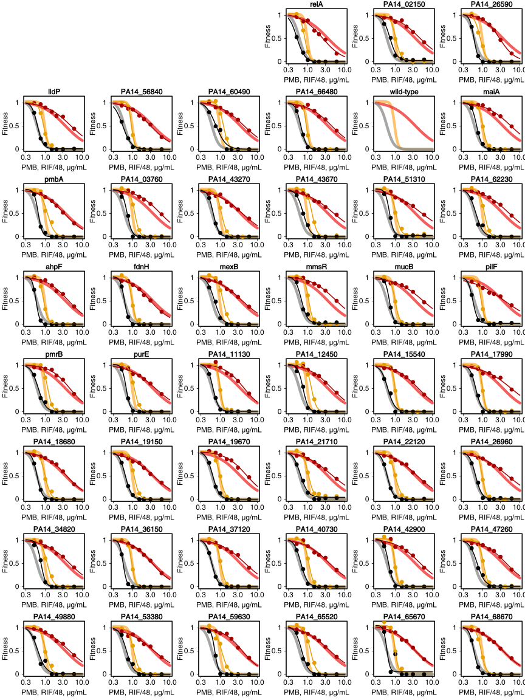
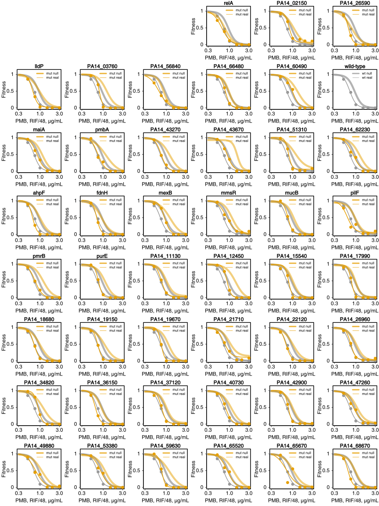

# Background 

We looked for combination therapies of neglected and misused antibiotics.
Rifampin and polymyxin B combination stood out as a promising approach against
scpectrum of clinical isolates.

This repository contains all the data and code to reproduce the analysis. For
details and full captions of figures, consult the publication.


```{r setup, include=FALSE}
knitr::opts_chunk$set(echo=FALSE, warning=FALSE, message=FALSE, dpi=300, fig.show = "hide")
knitr::opts_knit$set(global.par = TRUE)
library('data.table')
library('tidyverse')
library('DT')
library('cowplot')
library('BIGL')
library('drc')
library('rgl')

devtools::document('input/r')
suppressMessages(devtools::load_all('input/r'))

options(datatable.print.nrows=20)

theme_set(theme_html())
update_geom_defaults("point", list(size = 0.9))
update_geom_defaults("line", list(size = 0.5))
.text_size = 3
.point_size = 2
.facet_size = 8
theme_update(
  #legend.position = "bottom",
  strip.text.y = element_text(size = 8)
)
```

# Combinations

We studied the potential of the rifampicin-polymyxin B combination against
intra- and extracellular forms of bacteria: three _P. aeruginosa_ strains, 
two clinical isolates of _A. baumannii_, _E. cloacae_, and _K. pneumoniae_.


```{r}
dat = readRDS('../analysis/data/r_obj/pmb-rif_all-clean.rds')
dat[, effect := round(effect, 3)]

# incomplete data interferes with surface analysis methods
dat = dat[!(cond=='intra' & strain=='ATCC27853' &
  !(c1 %in% c(0, 0.0016, 0.016, 0.048, 0.16, 0.48, 
      4.8, 16, 48, 160, 480, 1600) &
   c2 %in% c(0, 0.0004, 0.003, 0.004, 0.012, 0.03, 
     0.12, 0.3, 1, 1.2, 3, 4, 30, 40, 60, 200)))
]
# arrive at informative and uniform concentration range
dat = dat[(d1 %between% c(0.003, 100) | d1==0) & (d2 %between% c(0.003, 100) | d2==0)]

dat[is.na(effect), effect := -4.5]

# Response surface analysis
# rs = getRS(dat, 'rs')
# rs = readRDS('input/dat/tmp/rs.rds')
# 
# open3d()
# lapply(names(rs), sav3D)
```


# Dose Response And pH

```{r SFig_monotherapy_dose-response_and_pH}
theme_set(theme_pdf())

sub = subset(dat, strain == 'ATCC27853' & (d1 == 0 | d2 == 0))

p1 = function() pltDR(effect ~ c1, subset(sub, c2==0), xlab = 'RIF, mg/L', zero=30)
p2 = function() pltDR(effect ~ c2, subset(sub, c1==0), col='orange', xlab = 'PMB, mg/L')

# pH
foo = fread("input/dat/raw/growth_and_pH.tsv")

foo = foo[time_h >= 0 & overnight_medium == 'pH7.4', .(
  od = gmu(od620),
  od.ci = gci(od620),
  ph = mean(pH),
  ph.ci = ci(pH)
  ), .(growth_medium, time_h)]


p0 = foo %>% 
  mutate(
    growth_medium = relevel(factor(growth_medium), 'pH7.4'),
    time_h = ifelse(time_h > 20, 20, time_h),
    NULL
    ) %>% 
  ggplot(aes(time_h, od, shape = growth_medium)) +
  scale_x_continuous(breaks = c(0, 5, 10, 20), labels = c(seq(0, 10, 5), 24), limits = c(0, 20)) +
  scale_shape_manual(name = '', values = c(19, 22, 15), labels = c('pH 7.4', 'pH 5.5',
      'pH 5.5 buffered')) +
  theme(legend.position = 'top')

p3 = p0 + 
  scale_y_continuous(trans='log2', breaks = c(0.001, 0.01, 0.1, 1), limits = c(0.001, 10)) + 
  geom_point(size=.point_size, col='grey20') +
  geom_pointrange(aes(ymin = od*od.ci, ymax = od/od.ci)) +
  geom_line(col='grey20') +
  labs(x = 'Time, h', y = expression('OD'[620]))

p4 = p0 %+% aes(y = ph) + 
  scale_y_continuous(position = 'right') +
  geom_point(size=.point_size, col=cbPalette[3]) +
  geom_line(col=cbPalette[3]) +
  geom_pointrange(aes(ymin = ph-ph.ci, ymax = ph + ph.ci), col=cbPalette[3]) +
  theme(legend.position = 'none',
    axis.title.y.right=element_text(color = cbPalette[3]),
    axis.text.y.right=element_text(color = cbPalette[3]),
    axis.ticks.y.right=element_line(color = cbPalette[3])
  ) +
  labs(x = '', y = 'pH')

aligned = align_plots(p3, p4, align = 'hv', axis = 'tblr')

plot_grid(
  ggdraw(p1), ggdraw(p2), ggdraw(aligned[[1]]) + draw_plot(aligned[[2]]), labels = 'AUTO', align = 'v'
)

# ggsave('output/fig/SFig_monotherapy_dose-response_and_pH.svg', width=10, height=9)
```


# Time-kill

```{r SFig_TimeKill}
dtk = fread('input/dat/raw/time-kill.csv') %>% 
  remNonCharcoal() %>% 
  addNewVariablesToTimeKill()

# pltTimeKill(dtk)
#ggsave('output/fig/SFig_TimeKill.svg', width=15, height=5)

# # Print out the concentrations used
# unique(dtk[time_h > 0], by = c('broth', 'group')) %>% 
#   .[, .(broth, group, d_1, d_2)] %>% 
#   .[order(group)]
```


# Reverse Genetics Screen

To account for the synergy in molecular terms—beyond a nonspecific increase in membrane permeability by polymyxin B—we turned to chemical genetics ([Brochado and Typas, 2013](https://doi.org/10.1016/j.mib.2013.01.008)). Working with ordered PA14 transposon library ([Liberati et al., 2006](https://doi.org/10.1073/pnas.0511100103)), we derived a growth measure for monotherapies and combinations using colony opacity ([Kritikos et al., 2017](https://doi.org/10.1038/nmicrobiol.2017.14)). To account for plate-to-plate variation, the opacity was multiplicatively corrected. This results in zero-centering of the Bliss scores, which were derived next. The significance of difference from zero Bliss score, for any mutant, was estimated by a T-test (5 biological replicates) and corrected for multiple testing (Benjamini-Hochberg).

```{r include=F}
dat = loadIrisFiles("input/dat/raw/iris_files") %>% 
  addIrisVars() %>% 
  # Manual curation by visual inspection of images
  remBadPlates() %>% 
  flagBadColonies() %>% 
  turnBadColoniesToNAs() %>% 
  # Automatic curation by numbers
  setMisdetectedColoniesToNAs() %>%   # colonies missing from 60% of plates
  # plate-to-plate correction, brings plate opacities to same median
  correctOpacityForPlates()

rep.correlations = getPairwiseReplicateCorrelations(dat)
candidate.files.to.kick.out = getCandidateFilesToKickOut(rep.correlations)
candidate.files.to.kick.out[ratio.discordant.vs.all==1, filename]
# [1] "LBpH5.5-Rifampicin16Polymyxin2-015.JPG.iris"

# Fitness ----------------------------------------
condition.vs.control = long2wide(dat)  # also average controls using median
#remember: opacity was replaced by the corrected opacity
condition.vs.control[,f.condition:=opacity/control.median]
# dim(condition.vs.control[is.na(f.condition)])[1] / dim(condition.vs.control)[1]
# [1] 0.02289894  #2.2% of fitness values are NA

# Epsilon ----------------------------------------
drug.merge = getEpsilons(condition.vs.control)

drug.merge = addAnnotation(drug.merge)
drug.merge = tTest(drug.merge)
chem.gen.res = getTTestResults(drug.merge) %>% 
  correctForMultipleTesting()
```

```{r ChemGen_LB}
tmp = chem.gen.res %>% 
  mutate(t.test.q.value = ifelse(t.test.q.value < 0.001, 0.001,
      t.test.q.value)) %>% 
  mutate(showname = ifelse(
      (t.test.q.value < 0.05 & gene.name != '') | t.test.q.value < 0.01 ,
      T, F)) 

(p0 = filter(tmp, media == 'LB') %>%  
  {
  ggplot(., aes(epsilon.median.mutant.condition, -log10(t.test.q.value), col = t.test.q.value < 0.05)) +
  geom_point(size = 2.5) +
  scale_color_manual(values = c('grey70', 'grey20')) +
  ggrepel::geom_text_repel(data= . %>% .[(showname)], size = 6,
    aes(label=gene.name.to.show), box.padding=0.75, seed=3) +
  lims(x = c(-0.8, 0.6)) +
  labs(x = 'Shift in Bliss score', y = expression('log'[10]*'(p-value)')) +
  theme(aspect.ratio = 1, legend.position = 'none')

})
# ggsave('output/fig/ChemGen_LB.svg', width=5, height=5)
```

```{r ChemGen_LBpH5.5}
p0 %+% filter(tmp, media == 'LBpH5.5')
# ggsave('output/fig/ChemGen_LBpH5.5.svg', width=5, height=5)
```
|**LB**                        |**LB pH 5.5**             |
|:-----------------------------|:-------------------------|
 | 


```{r revgen-venn}
getGenes = function (dat) {
  out = list()
  for(i in unique(dat$media))
    out[[i]] = unique(dat[t.test.q.value < 0.05 & media == i], by='locus') %>%
      .[, (gene.name.to.show)]
  return(out)
}

foo = getGenes(chem.gen.res)
#vtable = gplots::venn(foo)
```

## GO terms

With the following, we bring some biological knowledge into the analysis. This
will get us at the level of processes/compartments as opposed to individual
genes. We will focus on LB beacuse we have more data from there which is also
more reliable (75% of the unique hits come from LB; there is less variance). In
addition, our results suggest, the effect of pH on synergy is weak in
PA14.


We did Gene Set Enrichment Analysis (GSEA) using GO terms from [pseudomonas.com
website](https://www.pseudomonas.com/) and Kologorov-Smirnov testing for
statistical significance estimation. Although most common approach, it has been
critizised for example
[here](https://www.ncbi.nlm.nih.gov/pmc/articles/PMC3134237/). 

### Cell component

```{r topGO}
library('topGO')
tab = getTopGO(chem.gen.res)

tmpFun = function (dat, name='CC') {
  dat[[name]][1:10, c('GO.ID', 'Term', 'raw.p.value')] %>% 
    mutate(Pvalue = round(as.numeric(raw.p.value), 4))  %>% 
    dplyr::select(-raw.p.value) %>% 
    mutate(`GO.ID` = sub('GO:', '', `GO.ID`)) 
}

tmpFun(tab) %>%
  knitr::kable()
  # knitr::kable(format='latex', booktabs=T) %>% 
  # kableExtra::save_kable('output/fig/table_cell_component.png', font='Verdana')
```

### Biological process

```{r}
# biological processes
tmpFun(tab, 'BP') %>% 
  knitr::kable()
  # knitr::kable(format='latex', booktabs=T) %>% 
  # kableExtra::save_kable('output/fig/table_biological_process.png', font='Verdana')
```

## Protein-protein interaction network

Protein-protein interaction (PPI) analysis using STRING database. There was no
data on PA14, so we will use PAO1 data to build and analyse the network onto
which we then map PA14 orthologs. 

```{r SFig_ppi_cluster}
library(igraph)
library(stringr)

hits = addAnnotation(chem.gen.res[t.test.q.value < 0.05, .(colony)])
hit_list = unique(hits[PAO1.ortholog != '', PAO1.ortholog])

# bring in the interactome
string_11_pa = 'input/dat/raw/pao1_ppi_stringDB_287.protein.links.v11.0.txt' %>% 
  fread() %>% 
  .[, `:=` (
    combined_score = combined_score/1000,
    #strip / trim species ID
    protein1 = gsub("287.DR97_", "PA", protein1, fixed=TRUE),
    protein2 = gsub("287.DR97_", "PA", protein2, fixed=TRUE)
  )]

# create an igraph object
pa_ppi = graph.data.frame(string_11_pa, directed = FALSE)
# summary(pa_ppi)
V(pa_ppi)$degree = degree(pa_ppi)

pa_ppi = simplify(pa_ppi, remove.multiple=T, remove.loops=T, edge.attr.comb='mean')

# extract network for all the hits in the provided list
hit_ppi = induced.subgraph(pa_ppi, which(V(pa_ppi)$name %in% hit_list))

# store degree on the network (main hit network)
V(hit_ppi)$degree = degree(hit_ppi)

# Replace the PAO1 genes with corresponding PA14 ones
lookup = unique(hits[, .(PAO1.ortholog, gene=gene.name.to.show)], by='PAO1.ortholog')
V(hit_ppi)$name = left_join(data.table(PAO1.ortholog=V(hit_ppi)$name), lookup)[, gene]

# Communities ------------------------------
# Community detection based on edge betweenness (Newman-Girvan)
# pdf('output/pdf/graph.pdf', height=10, width=20)

par(mfrow=c(1, 1), mar=c(1,3,1,1), cex=0.6)

set.seed(1)
ceb = cluster_edge_betweenness(hit_ppi) 
V(hit_ppi)$community = ceb$membership
cols = ins(cbPalette, 'white', c(5, 8:9, 11:14))

#svg('output/fig/SFig_ppi_cluster.svg', width=20, height=20)
#dendPlot(ceb, mode="hclust", palette = myCols, cex=1.5, cex.axis=1.5)
plot(hit_ppi, vertex.color=cols[V(hit_ppi)$community],
  vertex.label.cex=2, edge.width=4, vertex.label.family="Helvetica",
  vertex.label.dist=0,  vertex.size=16,
  vertex.frame.color='black', vertex.label.color='black'
)
#dev.off()
```


The major graph communities, using (Newman-Girvan's edge betweenness):

1. The light blue nodes are central and seem to be enriched in regulatory genes.
2. The grey nodes seem to be a signal transduction from membrane to the
   regulatory genes (in light blue).
3. Orange and pink nodes are mostly related to metabolism; those in orange have
   more membrane related terms than the pink nodes. 


# Screen Validation

We validate the sensitivity of identified candidate mutants in low
throughput and in liquid LB medium at pH 7.4. Instead of factorial (i.e.
checkerboard), we use a fixed ratio design [Tallarida et al
1997](https://doi.org/10.1016/s0024-3205(97)01030-8).

```{r}
dat = fread('input/dat/raw/pa14_mut_pmb_rif.csv') %>% 
  addDrugRatio() %>% 
  addAUC() %>% 
  addFitness() %>% 
  remDissimilarExperimentalConditions() %>% 
  addPA14MutAnnotation()

dat[, dose:= ifelse(cond_f %in% c('PMB', 'combo'), d1, d2)]
dat_lst  = split(dat, dat$mut)
fit = lapply(dat_lst, fitPA14MutDR, curveid = cond_f)

# Loewe response surface ------------------------------
# rs = getPa14RS(dat)

# We'll use a snapshot of results from 2021-01-02
rsl = readRDS('input/dat/rds/2020-01-02_rs_pa14.rds') %>% lapply(., function(x) x$rsl)
foo = lapply(rsl, function(x) summary(x$maxR)$totals) %>% rbindlist(idcol='mut')
# Mutant numbering is potential source of confusion; hence I assign here
# manually: wild-type is coded as mut 0, fitting of mut 28 failed
foo[, mut := c(0:27, 29:45)]  
#arrange(foo, Syn) %>% print(20)
```

## Dose-response

```{r SFig_45PA14MutDoseResponses}
#svg('output/fig/SFig_45PA14MutDoseResponses.svg', 12, 16)
#plt45PA14MutantDR()  # dose-responses
#dev.off()
```



## Compare to Loewe's null

```{r SFig_45PA14MutCompLoeweNull}
#svg('output/fig/SFig_45PA14MutCompLoeweNull.svg', 12, 16)
# We'll use a snapshot of results from 2021-01-02
#plt45PA14MutantComparisonToLoeweNull('2020-01-02_rs_pa14')
#dev.off()
```




## Table with _E. coli_ orthologs

```{r}
getValidHitTable() %>% addEcOrthologs() %>% .[,-'locus_pa'] %>% 
  knitr::kable()
  #knitr::kable(format='latex', booktabs=T) %>% 
  #kableExtra::save_kable('output/fig/table_valid_hit.png')
```


## GO term table

```{r}
getGoTermTable() %>% 
  knitr::kable() 
  #knitr::kable(format='latex', booktabs=T) %>% 
  #kableExtra::save_kable('output/fig/table_valid_hit_go.png', font='Verdana')
```

# Selected five mutants

```{r surface_analysis}
#rs = fread('input/dat/raw/pa14_mut_pmb_rif_cfu.csv') %>% 
#  prepForRS()  %>% 
#  setDT()  %>% 
#  addMutGeneNames() %>% 
#  getRS(., 'rs_6mut')
rs = readRDS('input/dat/tmp/rs_6mut.rds')
```

```{r}
rsl = lapply(rs, function(x) lapply(x, function(y) y$rsl))
lapply(rs, names)

lapply(names(rs), sav3D, xcap=10)
```
