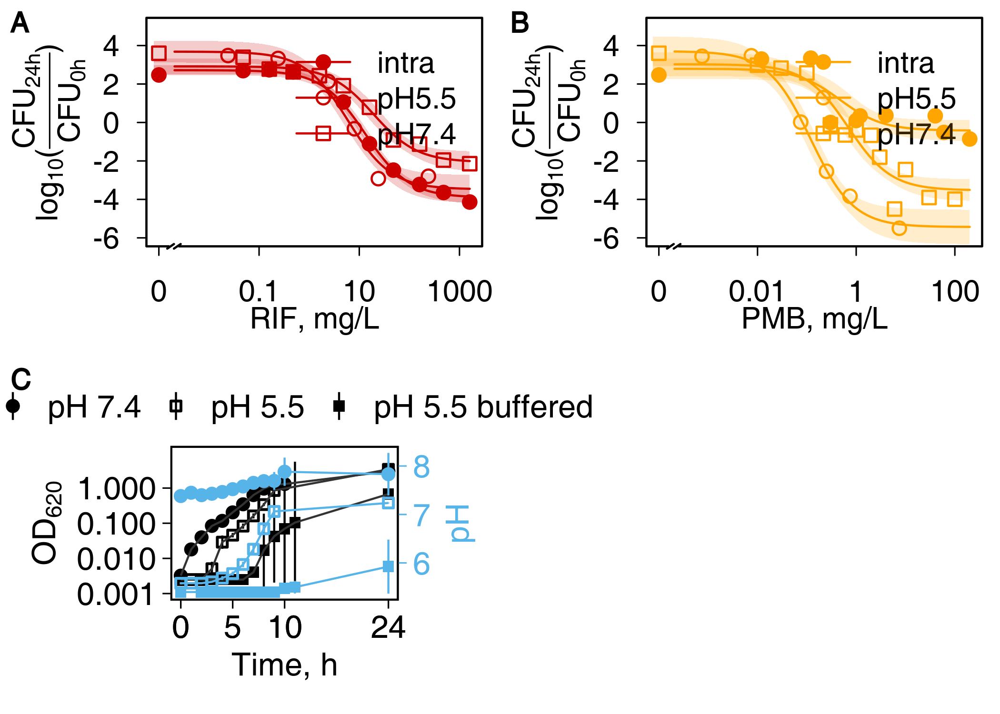
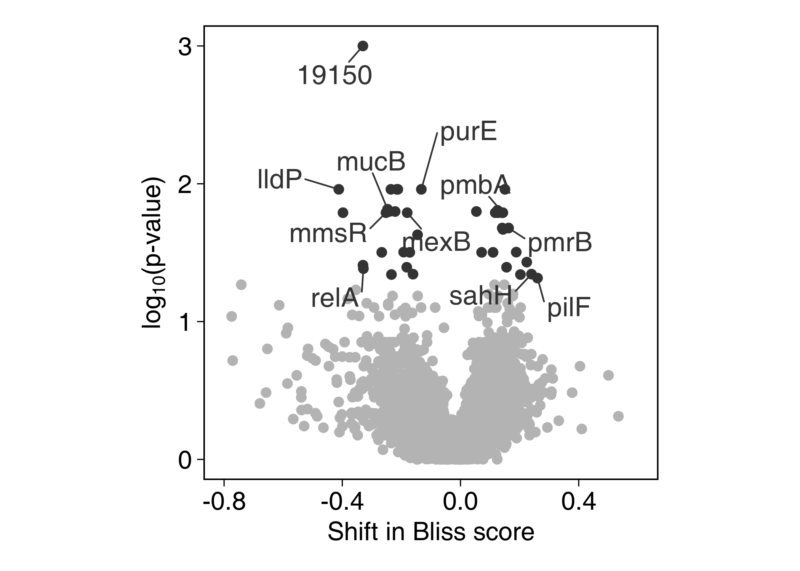
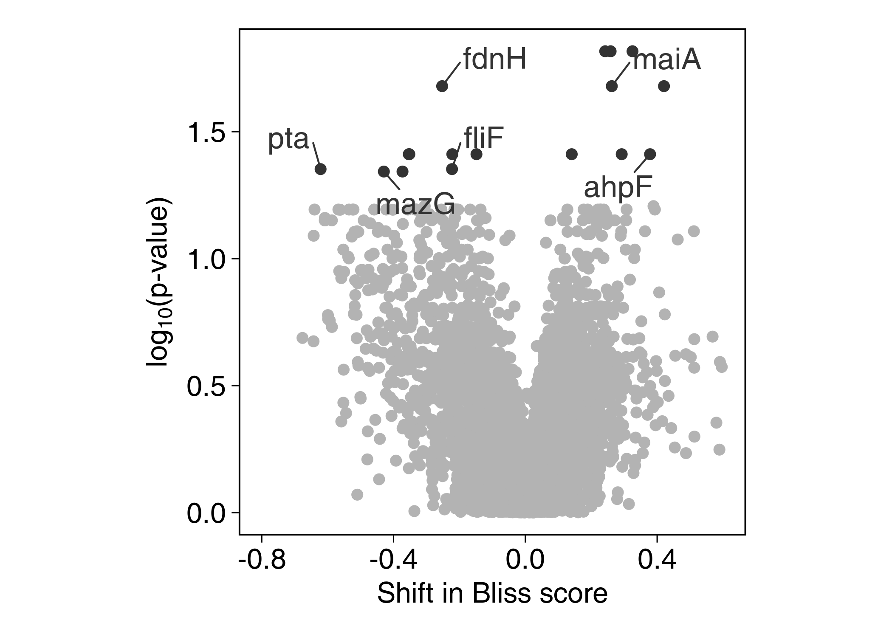
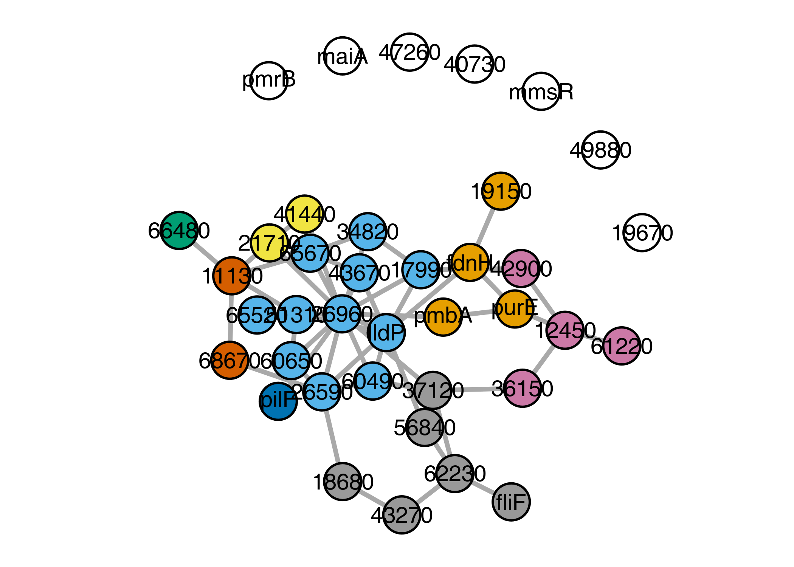
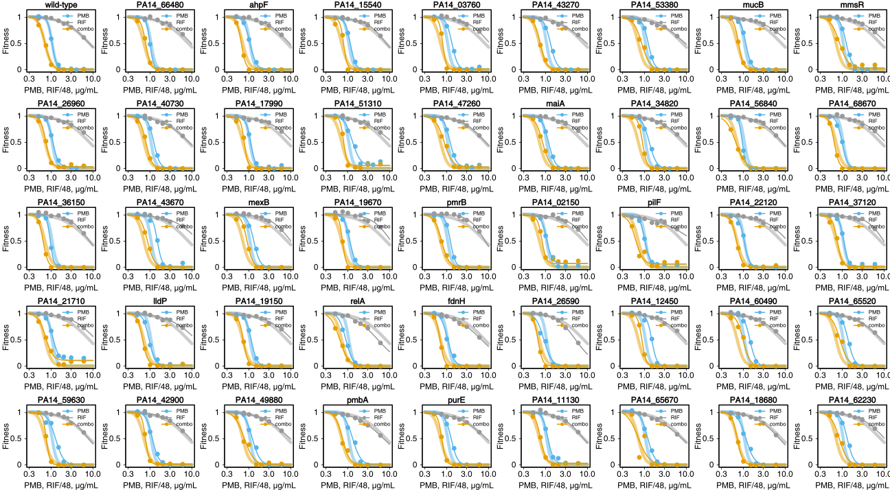
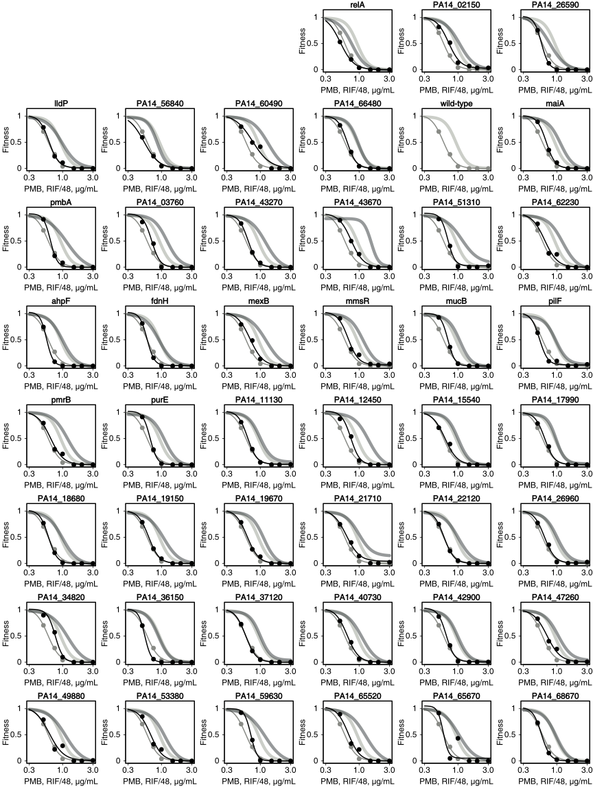
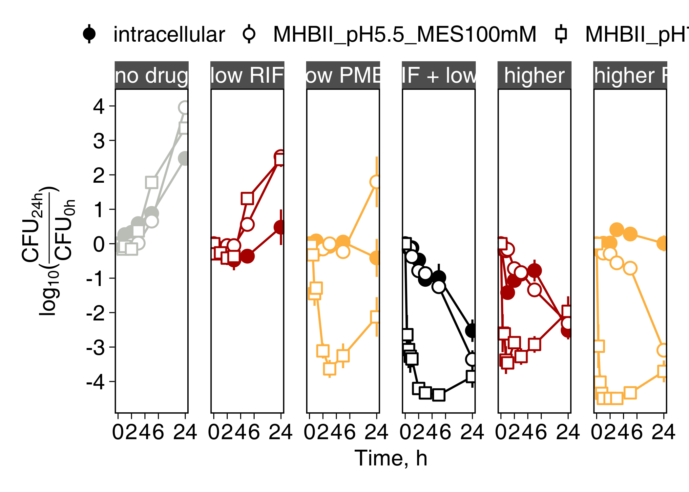

-   [Background](#background)
-   [Combinations](#combinations)
-   [Dose Response And pH](#dose-response-and-ph)
-   [Reverse Genetics Screen](#reverse-genetics-screen)
-   [GO terms](#go-terms)
-   [Protein-protein interaction
    network](#protein-protein-interaction-network)
-   [Screen Validation](#screen-validation)
-   [Validated genes](#validated-genes)
-   [Time-kill](#time-kill)

# Background

We looked for combination therapies of neglected and misused
antibiotics. Rifampin and polymyxin B combination stood out as a
promising approach against scpectrum of clinical isolates.

# Combinations

We studied the potential of the rifampicin-polymyxin B combination
against intra- and extracellular forms of bacteria: three *P.
aeruginosa* strains, two clinical isolates of *A. baumannii*, *E.
cloacae*, and *K. pneumoniae*.

# Dose Response And pH

# Reverse Genetics Screen

To account for the synergy in molecular terms—beyond a nonspecific
increase in membrane permeability by polymyxin B—we turned to chemical
genetics [Brochado and Typas,
2013](https://doi.org/10.1016/j.mib.2013.01.008). Working with ordered
PA14 transposon library [Liberati et al.,
2006](https://doi.org/10.1073/pnas.0511100103), we derived a growth
measure for monotherapies and combinations using colony opacity
[Kritikos et al., 2017](https://doi.org/10.1038/nmicrobiol.2017.14). To
account for plate-to-plate variation, the opacity was multiplicatively
corrected. This results in zero-centering of the Bliss scores, which
were derived next. The significance of difference from zero Bliss score,
for any mutant, was estimated by a T-test (5 biological replicates) and
corrected for multiple testing (Benjamini-Hochberg).

    ## Warning: only one replicate for LB-Rifampicin16Polymyxin2 in library plate2

    ## [1] "LBpH5.5-Rifampicin16Polymyxin2-015.JPG.iris"

# GO terms

With the following, we bring some biological knowledge into the
analysis. This will get us at the level of processes/compartments as
opposed to individual genes. We will focus on LB beacuse we have more
data from there which is also more reliable (75% of the unique hits come
from LB; there is less variance). In addition, our results suggest, the
effect of pH on synergy is questionable in PA14.

We did Gene Set Enrichment Analysis (GSEA) using GO terms from
[pseudomonas.com website](https://www.pseudomonas.com/) and
Kologorov-Smirnov testing for statistical significance estimation.
Although most common approach, it has been critizised for example
[here](https://www.ncbi.nlm.nih.gov/pmc/articles/PMC3134237/).

<table style="width:100%;">
<colgroup>
<col style="width: 9%" />
<col style="width: 73%" />
<col style="width: 10%" />
<col style="width: 6%" />
</colgroup>
<thead>
<tr class="header">
<th style="text-align: left;">GO.ID</th>
<th style="text-align: left;">Term</th>
<th style="text-align: left;">raw.p.value</th>
<th style="text-align: right;">Pvalue</th>
</tr>
</thead>
<tbody>
<tr class="odd">
<td style="text-align: left;"><a href="GO:0016021" class="uri">GO:0016021</a></td>
<td style="text-align: left;">integral component of membrane</td>
<td style="text-align: left;">0.015</td>
<td style="text-align: right;">0.015</td>
</tr>
<tr class="even">
<td style="text-align: left;"><a href="GO:0005694" class="uri">GO:0005694</a></td>
<td style="text-align: left;">chromosome</td>
<td style="text-align: left;">0.072</td>
<td style="text-align: right;">0.072</td>
</tr>
<tr class="odd">
<td style="text-align: left;"><a href="GO:0008076" class="uri">GO:0008076</a></td>
<td style="text-align: left;">voltage-gated potassium channel complex</td>
<td style="text-align: left;">0.140</td>
<td style="text-align: right;">0.140</td>
</tr>
<tr class="even">
<td style="text-align: left;"><a href="GO:0055052" class="uri">GO:0055052</a></td>
<td style="text-align: left;">ATP-binding cassette (ABC) transporter complex, substrate-binding subunit-containing</td>
<td style="text-align: left;">0.146</td>
<td style="text-align: right;">0.146</td>
</tr>
<tr class="odd">
<td style="text-align: left;"><a href="GO:0009289" class="uri">GO:0009289</a></td>
<td style="text-align: left;">pilus</td>
<td style="text-align: left;">0.163</td>
<td style="text-align: right;">0.163</td>
</tr>
<tr class="even">
<td style="text-align: left;"><a href="GO:0033573" class="uri">GO:0033573</a></td>
<td style="text-align: left;">high-affinity iron permease complex</td>
<td style="text-align: left;">0.166</td>
<td style="text-align: right;">0.166</td>
</tr>
<tr class="odd">
<td style="text-align: left;"><a href="GO:0005839" class="uri">GO:0005839</a></td>
<td style="text-align: left;">proteasome core complex</td>
<td style="text-align: left;">0.183</td>
<td style="text-align: right;">0.183</td>
</tr>
<tr class="even">
<td style="text-align: left;"><a href="GO:0005960" class="uri">GO:0005960</a></td>
<td style="text-align: left;">glycine cleavage complex</td>
<td style="text-align: left;">0.227</td>
<td style="text-align: right;">0.227</td>
</tr>
<tr class="odd">
<td style="text-align: left;"><a href="GO:0030257" class="uri">GO:0030257</a></td>
<td style="text-align: left;">type III protein secretion system complex</td>
<td style="text-align: left;">0.252</td>
<td style="text-align: right;">0.252</td>
</tr>
<tr class="even">
<td style="text-align: left;"><a href="GO:0005615" class="uri">GO:0005615</a></td>
<td style="text-align: left;">extracellular space</td>
<td style="text-align: left;">0.253</td>
<td style="text-align: right;">0.253</td>
</tr>
</tbody>
</table>

    ##         GO.ID                                    Term raw.p.value
    ## 1  GO:0009236          cobalamin biosynthetic process       0.017
    ## 2  GO:0055114             oxidation-reduction process       0.019
    ## 3  GO:0009116            nucleoside metabolic process       0.024
    ## 4  GO:0019700   organic phosphonate catabolic process       0.039
    ## 5  GO:0017000         antibiotic biosynthetic process       0.040
    ## 6  GO:0070475                   rRNA base methylation       0.050
    ## 7  GO:0009306                       protein secretion       0.056
    ## 8  GO:0044010        single-species biofilm formation       0.063
    ## 9  GO:0019354           siroheme biosynthetic process       0.067
    ## 10 GO:0044262 cellular carbohydrate metabolic process       0.074

# Protein-protein interaction network

Protein-protein interaction (PPI) analysis using STRING database. There
was no data on PA14, so we will use PAO1 data to build and analyse the
network onto which we then map PA14 orthologs.

The major graph communities, using (Newman-Girvan’s edge betweenness):
1. The light blue nodes are central and seem to be enriched in
regulatory genes. 2. The grey nodes seem to be a signal transduction
from membrane to the regulatory genes (in light blue). 3. Orange and
pink nodes are mostly related to metabolism; those in orange have more
membrane related terms than the pink nodes.

# Screen Validation

We validate the sensitivity of identified candidate mutants in low
throughput and in liquid LB medium at pH 7.4. Instead of factorial (i.e.
checkerboard), we use a fixed ratio design [Tallarida et al
1997](https://doi.org/10.1016/s0024-3205(97)01030-8).

    ##     mut Call Syn Ant Total
    ##  1:  23 None   0   0     8
    ##  2:  31 None   0   0     8
    ##  3:  33 None   0   0     8
    ##  4:   1  Syn   1   0     8
    ##  5:  16  Syn   1   0     8
    ##  6:  29  Syn   1   0     8
    ##  7:  35  Syn   1   0     8
    ##  8:   0  Syn   2   0     8
    ##  9:   2  Syn   2   0     8
    ## 10:   3  Syn   2   0     8
    ## 11:   6  Syn   2   0     8
    ## 12:   7  Syn   2   0     8
    ## 13:   8  Syn   2   0     8
    ## 14:   9  Syn   2   0     8
    ## 15:  10  Syn   2   0     8
    ## 16:  11  Syn   2   0     8
    ## 17:  13  Syn   2   0     8
    ## 18:  15  Syn   2   0     8
    ## 19:  17  Syn   2   0     8
    ## 20:  18  Syn   2   0     8
    ## ---                       
    ## 26:  26  Syn   2   0     8
    ## 27:  27  Syn   2   0     8
    ## 28:  30  Syn   2   0     8
    ## 29:  32  Syn   2   0     8
    ## 30:  34  Syn   2   0     8
    ## 31:  36  Syn   2   0     8
    ## 32:  37  Syn   2   0     8
    ## 33:  38  Syn   2   0     8
    ## 34:  39  Syn   2   0     8
    ## 35:  41  Syn   2   0     8
    ## 36:  42  Syn   2   0     8
    ## 37:  43  Syn   2   0     8
    ## 38:  44  Syn   2   0     8
    ## 39:   4  Syn   3   0     8
    ## 40:   5  Syn   3   0     8
    ## 41:  14  Syn   3   0     8
    ## 42:  19  Syn   3   0     8
    ## 43:  40  Syn   3   0     8
    ## 44:  45  Syn   3   0     8
    ## 45:  12  Syn   4   0     8

# Validated genes

**Table 1: Mutants with altered RIF-PMB interaction profile and
corresponding gene in *E. coli*.** Only four genes had designated
orthologs in *E. coli*.

<table>
<colgroup>
<col style="width: 8%" />
<col style="width: 12%" />
<col style="width: 8%" />
<col style="width: 70%" />
</colgroup>
<thead>
<tr class="header">
<th style="text-align: left;">EC gene</th>
<th style="text-align: left;">PA gene</th>
<th style="text-align: left;">Synergy</th>
<th style="text-align: left;">Description</th>
</tr>
</thead>
<tbody>
<tr class="odd">
<td style="text-align: left;"></td>
<td style="text-align: left;">PA14_02150</td>
<td style="text-align: left;">none</td>
<td style="text-align: left;">Serine phosphatase RsbU, regulator of sigma subunit</td>
</tr>
<tr class="even">
<td style="text-align: left;">relA</td>
<td style="text-align: left;">relA</td>
<td style="text-align: left;">none</td>
<td style="text-align: left;">(p)ppGpp synthetase</td>
</tr>
<tr class="odd">
<td style="text-align: left;"></td>
<td style="text-align: left;">PA14_26590</td>
<td style="text-align: left;">none</td>
<td style="text-align: left;">GntR family transcriptional regulator</td>
</tr>
<tr class="even">
<td style="text-align: left;"></td>
<td style="text-align: left;">PA14_66480</td>
<td style="text-align: left;">less</td>
<td style="text-align: left;">Predicted ATPase involved in chromosome partitioning</td>
</tr>
<tr class="odd">
<td style="text-align: left;"></td>
<td style="text-align: left;">PA14_56840</td>
<td style="text-align: left;">less</td>
<td style="text-align: left;">Predicted thiol oxidoreductase</td>
</tr>
<tr class="even">
<td style="text-align: left;">glcA</td>
<td style="text-align: left;">lldP</td>
<td style="text-align: left;">less</td>
<td style="text-align: left;">L-lactate permease</td>
</tr>
<tr class="odd">
<td style="text-align: left;"></td>
<td style="text-align: left;">PA14_60490</td>
<td style="text-align: left;">less</td>
<td style="text-align: left;">cytochrome c</td>
</tr>
<tr class="even">
<td style="text-align: left;"></td>
<td style="text-align: left;">PA14_03760</td>
<td style="text-align: left;">more</td>
<td style="text-align: left;">sodium:solute symporter</td>
</tr>
<tr class="odd">
<td style="text-align: left;">selU</td>
<td style="text-align: left;">PA14_43270</td>
<td style="text-align: left;">more</td>
<td style="text-align: left;">tRNA 2-selenouridine synthase</td>
</tr>
<tr class="even">
<td style="text-align: left;"></td>
<td style="text-align: left;">PA14_51310</td>
<td style="text-align: left;">more</td>
<td style="text-align: left;">Predicted redox protein, regulator of disulfide bond formation</td>
</tr>
<tr class="odd">
<td style="text-align: left;"></td>
<td style="text-align: left;">maiA</td>
<td style="text-align: left;">more</td>
<td style="text-align: left;">maleylacetoacetate isomerase</td>
</tr>
<tr class="even">
<td style="text-align: left;"></td>
<td style="text-align: left;">PA14_43670</td>
<td style="text-align: left;">more</td>
<td style="text-align: left;">sensor/response regulator hybrid</td>
</tr>
<tr class="odd">
<td style="text-align: left;">pmbA</td>
<td style="text-align: left;">pmbA</td>
<td style="text-align: left;">more</td>
<td style="text-align: left;">PmbA protein</td>
</tr>
<tr class="even">
<td style="text-align: left;"></td>
<td style="text-align: left;">PA14_62230</td>
<td style="text-align: left;">more</td>
<td style="text-align: left;">Predicted kinase</td>
</tr>
</tbody>
</table>

\*\* Table 2 : Biological context of mutants. \*\*

<table>
<colgroup>
<col style="width: 7%" />
<col style="width: 9%" />
<col style="width: 40%" />
<col style="width: 41%" />
</colgroup>
<thead>
<tr class="header">
<th style="text-align: left;">PA gene</th>
<th style="text-align: left;">Location</th>
<th style="text-align: left;">Process</th>
<th style="text-align: left;">Function</th>
</tr>
</thead>
<tbody>
<tr class="odd">
<td style="text-align: left;">02150</td>
<td style="text-align: left;">membrane</td>
<td style="text-align: left;">signal transduction</td>
<td style="text-align: left;">catalytic</td>
</tr>
<tr class="even">
<td style="text-align: left;">03760</td>
<td style="text-align: left;">membrane</td>
<td style="text-align: left;">transmembrane transport</td>
<td style="text-align: left;">transmembrane transporter</td>
</tr>
<tr class="odd">
<td style="text-align: left;">26590</td>
<td style="text-align: left;">NA</td>
<td style="text-align: left;">regulation of transcription; biosynthesis</td>
<td style="text-align: left;">catalytic; transcription factor</td>
</tr>
<tr class="even">
<td style="text-align: left;">43270</td>
<td style="text-align: left;">NA</td>
<td style="text-align: left;">tRNA seleno-modification</td>
<td style="text-align: left;">transferase for selenium-containing groups</td>
</tr>
<tr class="odd">
<td style="text-align: left;">43670</td>
<td style="text-align: left;">membrane</td>
<td style="text-align: left;">signal transduction; phosphorylation</td>
<td style="text-align: left;">phosphorelay sensor kinase</td>
</tr>
<tr class="even">
<td style="text-align: left;">56840</td>
<td style="text-align: left;">NA</td>
<td style="text-align: left;">NA</td>
<td style="text-align: left;">electron transfer; heme binding</td>
</tr>
<tr class="odd">
<td style="text-align: left;">60490</td>
<td style="text-align: left;">NA</td>
<td style="text-align: left;">NA</td>
<td style="text-align: left;">electron transfer; heme binding</td>
</tr>
<tr class="even">
<td style="text-align: left;">lldP</td>
<td style="text-align: left;">membrane</td>
<td style="text-align: left;">lactate transport</td>
<td style="text-align: left;">lactate transmembrane transport</td>
</tr>
<tr class="odd">
<td style="text-align: left;">maiA</td>
<td style="text-align: left;">cytoplasm</td>
<td style="text-align: left;">aromatic amino acid metabolism</td>
<td style="text-align: left;">catalytic; protein binding</td>
</tr>
<tr class="even">
<td style="text-align: left;">pmbA</td>
<td style="text-align: left;">NA</td>
<td style="text-align: left;">peptidoglycan biosynthesis; proteolysis</td>
<td style="text-align: left;">metallopeptidase</td>
</tr>
<tr class="odd">
<td style="text-align: left;">relA</td>
<td style="text-align: left;">NA</td>
<td style="text-align: left;">ppGpp metabolic process</td>
<td style="text-align: left;">NA</td>
</tr>
</tbody>
</table>

# Time-kill

