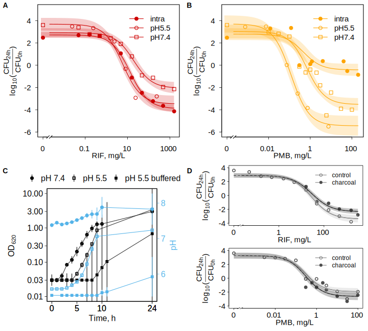
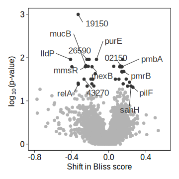
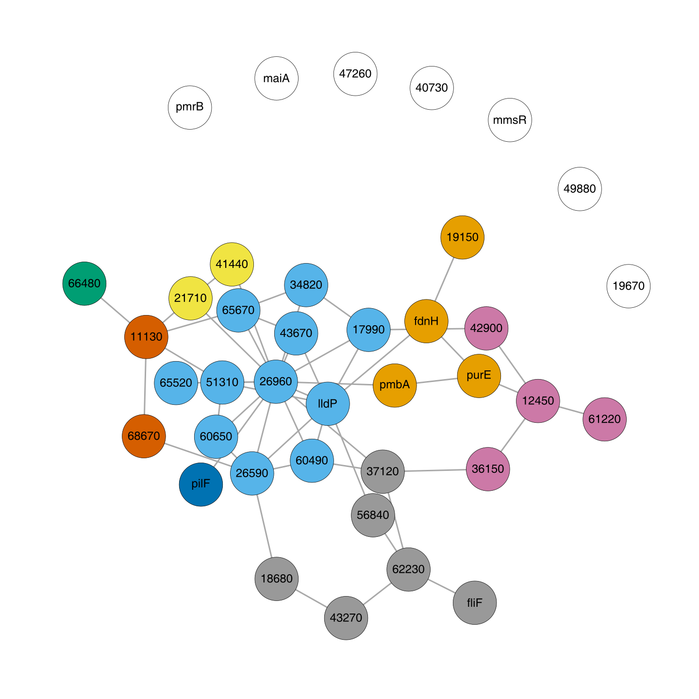
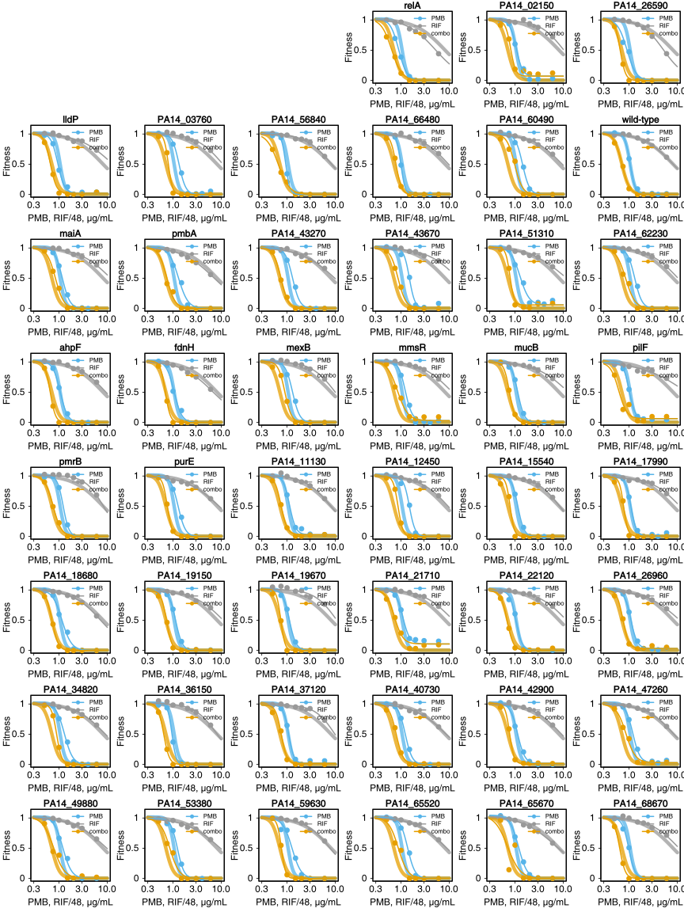
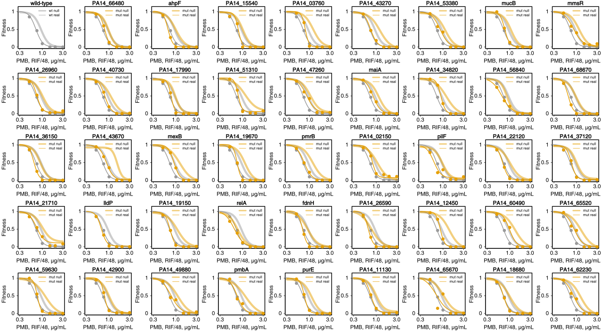

-   [Background](#background)
-   [Combinations](#combinations)
-   [Dose Response And pH](#dose-response-and-ph)
-   [Time-kill](#time-kill)
-   [Reverse Genetics Screen](#reverse-genetics-screen)
    -   [GO terms](#go-terms)
    -   [Protein-protein interaction
        network](#protein-protein-interaction-network)
-   [Screen Validation](#screen-validation)
    -   [Dose-response](#dose-response)
    -   [Compare to Loewe’s null](#compare-to-loewes-null)
    -   [Table with *E. coli* orthologs](#table-with-e.-coli-orthologs)
    -   [GO term table](#go-term-table)
-   [Selected five mutants](#selected-five-mutants)
-   [PMB resistant isolates](#pmb-resistant-isolates)
-   [Supplementary Membrane Assays](#supplementary-membrane-assays)

# Background

We looked for combination therapies of neglected and misused
antibiotics. Rifampin and polymyxin B combination stood out as a
promising approach against scpectrum of clinical isolates. This
repository contains all the data and code to reproduce the analysis. For
details and full captions of figures, consult the publication.

# Combinations

We studied the potential of the rifampicin-polymyxin B combination
against intra- and extracellular forms of bacteria: three *P.
aeruginosa* strains, two clinical isolates of *A. baumannii*, *E.
coli*, and *K. pneumoniae*.

# Dose Response And pH

# Time-kill

# Reverse Genetics Screen

To account for the synergy in molecular terms—beyond a nonspecific
increase in membrane permeability by polymyxin B—we turned to chemical
genetics ([Brochado and Typas,
2013](https://doi.org/10.1016/j.mib.2013.01.008)). Working with ordered
PA14 transposon library ([Liberati et al.,
2006](https://doi.org/10.1073/pnas.0511100103)), we derived a growth
measure for monotherapies and combinations using colony opacity
([Kritikos et al., 2017](https://doi.org/10.1038/nmicrobiol.2017.14)).
To account for plate-to-plate variation, the opacity was
multiplicatively corrected. This results in zero-centering of the Bliss
scores, which were derived next. The significance of difference from
zero Bliss score, for any mutant, was estimated by a T-test (5
biological replicates) and corrected for multiple testing
(Benjamini-Hochberg).

Of the 70 hits, 53 are from mutant level of analysis and 17 come from
gene level of analysis. 31 are shared between mutants and genes
i.e. hits regardless if mutant or gene level of analysis is used.

<table>
<thead>
<tr class="header">
<th style="text-align: left;"><strong>LB</strong></th>
<th style="text-align: left;"><strong>LB pH 5.5</strong></th>
</tr>
</thead>
<tbody>
<tr class="odd">
<td style="text-align: left;"></td>
<td style="text-align: left;"></td>
</tr>
</tbody>
</table>

## GO terms

With the following, we bring some biological knowledge into the
analysis. This will get us at the level of processes/compartments as
opposed to individual genes. We will focus on LB beacuse we have more
data from there which is also more reliable (75% of the unique hits come
from LB; there is less variance). In addition, our results suggest, the
effect of pH on synergy is weak in PA14.

We did Gene Set Enrichment Analysis (GSEA) using GO terms from
[pseudomonas.com website](https://www.pseudomonas.com/) and
Kologorov-Smirnov testing for statistical significance estimation.
Although most common approach, it has been critizised for example
[here](https://www.ncbi.nlm.nih.gov/pmc/articles/PMC3134237/).

### Cell component

<table>
<thead>
<tr>
<th style="text-align:left;">
GO.ID
</th>
<th style="text-align:left;">
Term
</th>
<th style="text-align:right;">
Pvalue
</th>
</tr>
</thead>
<tbody>
<tr>
<td style="text-align:left;">
0016021
</td>
<td style="text-align:left;">
integral component of membrane
</td>
<td style="text-align:right;">
0.015
</td>
</tr>
<tr>
<td style="text-align:left;">
0005694
</td>
<td style="text-align:left;">
chromosome
</td>
<td style="text-align:right;">
0.072
</td>
</tr>
<tr>
<td style="text-align:left;">
0008076
</td>
<td style="text-align:left;">
voltage-gated potassium channel complex
</td>
<td style="text-align:right;">
0.140
</td>
</tr>
<tr>
<td style="text-align:left;">
0055052
</td>
<td style="text-align:left;">
ATP-binding cassette (ABC) transporter complex, substrate-binding
subunit-containing
</td>
<td style="text-align:right;">
0.146
</td>
</tr>
<tr>
<td style="text-align:left;">
0009289
</td>
<td style="text-align:left;">
pilus
</td>
<td style="text-align:right;">
0.163
</td>
</tr>
<tr>
<td style="text-align:left;">
0033573
</td>
<td style="text-align:left;">
high-affinity iron permease complex
</td>
<td style="text-align:right;">
0.166
</td>
</tr>
<tr>
<td style="text-align:left;">
0005839
</td>
<td style="text-align:left;">
proteasome core complex
</td>
<td style="text-align:right;">
0.183
</td>
</tr>
<tr>
<td style="text-align:left;">
0005960
</td>
<td style="text-align:left;">
glycine cleavage complex
</td>
<td style="text-align:right;">
0.227
</td>
</tr>
<tr>
<td style="text-align:left;">
0030257
</td>
<td style="text-align:left;">
type III protein secretion system complex
</td>
<td style="text-align:right;">
0.252
</td>
</tr>
<tr>
<td style="text-align:left;">
0005615
</td>
<td style="text-align:left;">
extracellular space
</td>
<td style="text-align:right;">
0.253
</td>
</tr>
</tbody>
</table>

### Biological process

<table>
<thead>
<tr>
<th style="text-align:left;">
GO.ID
</th>
<th style="text-align:left;">
Term
</th>
<th style="text-align:right;">
Pvalue
</th>
</tr>
</thead>
<tbody>
<tr>
<td style="text-align:left;">
0009236
</td>
<td style="text-align:left;">
cobalamin biosynthetic process
</td>
<td style="text-align:right;">
0.017
</td>
</tr>
<tr>
<td style="text-align:left;">
0055114
</td>
<td style="text-align:left;">
oxidation-reduction process
</td>
<td style="text-align:right;">
0.019
</td>
</tr>
<tr>
<td style="text-align:left;">
0009116
</td>
<td style="text-align:left;">
nucleoside metabolic process
</td>
<td style="text-align:right;">
0.024
</td>
</tr>
<tr>
<td style="text-align:left;">
0019700
</td>
<td style="text-align:left;">
organic phosphonate catabolic process
</td>
<td style="text-align:right;">
0.039
</td>
</tr>
<tr>
<td style="text-align:left;">
0017000
</td>
<td style="text-align:left;">
antibiotic biosynthetic process
</td>
<td style="text-align:right;">
0.040
</td>
</tr>
<tr>
<td style="text-align:left;">
0070475
</td>
<td style="text-align:left;">
rRNA base methylation
</td>
<td style="text-align:right;">
0.050
</td>
</tr>
<tr>
<td style="text-align:left;">
0009306
</td>
<td style="text-align:left;">
protein secretion
</td>
<td style="text-align:right;">
0.056
</td>
</tr>
<tr>
<td style="text-align:left;">
0044010
</td>
<td style="text-align:left;">
single-species biofilm formation
</td>
<td style="text-align:right;">
0.063
</td>
</tr>
<tr>
<td style="text-align:left;">
0019354
</td>
<td style="text-align:left;">
siroheme biosynthetic process
</td>
<td style="text-align:right;">
0.067
</td>
</tr>
<tr>
<td style="text-align:left;">
0044262
</td>
<td style="text-align:left;">
cellular carbohydrate metabolic process
</td>
<td style="text-align:right;">
0.074
</td>
</tr>
</tbody>
</table>

## Protein-protein interaction network

Protein-protein interaction (PPI) analysis using STRING database. There
was no data on PA14, so we will use PAO1 data to build and analyse the
network onto which we then map PA14 orthologs.

The major graph communities, using (Newman-Girvan’s edge betweenness):

1.  The light blue nodes are central and seem to be enriched in
    regulatory genes.
2.  The grey nodes seem to be a signal transduction from membrane to the
    regulatory genes (in light blue).
3.  Orange and pink nodes are mostly related to metabolism; those in
    orange have more membrane related terms than the pink nodes.

# Screen Validation

We validate the sensitivity of identified candidate mutants in low
throughput and in liquid LB medium at pH 7.4. Instead of factorial (i.e.
checkerboard), we use a fixed ratio design [Tallarida et al
1997](https://doi.org/10.1016/s0024-3205(97)01030-8).

## Dose-response

## Compare to Loewe’s null

## Table with *E. coli* orthologs

<table>
<thead>
<tr>
<th style="text-align:left;">
PA gene
</th>
<th style="text-align:left;">
EC ortholog
</th>
<th style="text-align:left;">
Synergy
</th>
<th style="text-align:left;">
Description
</th>
</tr>
</thead>
<tbody>
<tr>
<td style="text-align:left;">
02150
</td>
<td style="text-align:left;">
</td>
<td style="text-align:left;">
none
</td>
<td style="text-align:left;">
Serine phosphatase RsbU, regulator of sigma subunit
</td>
</tr>
<tr>
<td style="text-align:left;">
relA
</td>
<td style="text-align:left;">
relA
</td>
<td style="text-align:left;">
none
</td>
<td style="text-align:left;">
(p)ppGpp synthetase
</td>
</tr>
<tr>
<td style="text-align:left;">
26590
</td>
<td style="text-align:left;">
</td>
<td style="text-align:left;">
none
</td>
<td style="text-align:left;">
GntR family transcriptional regulator
</td>
</tr>
<tr>
<td style="text-align:left;">
66480
</td>
<td style="text-align:left;">
</td>
<td style="text-align:left;">
less
</td>
<td style="text-align:left;">
Predicted ATPase involved in chromosome partitioning
</td>
</tr>
<tr>
<td style="text-align:left;">
56840
</td>
<td style="text-align:left;">
</td>
<td style="text-align:left;">
less
</td>
<td style="text-align:left;">
Predicted thiol oxidoreductase
</td>
</tr>
<tr>
<td style="text-align:left;">
lldP
</td>
<td style="text-align:left;">
glcA
</td>
<td style="text-align:left;">
less
</td>
<td style="text-align:left;">
L-lactate permease
</td>
</tr>
<tr>
<td style="text-align:left;">
60490
</td>
<td style="text-align:left;">
</td>
<td style="text-align:left;">
less
</td>
<td style="text-align:left;">
cytochrome c
</td>
</tr>
<tr>
<td style="text-align:left;">
03760
</td>
<td style="text-align:left;">
</td>
<td style="text-align:left;">
more
</td>
<td style="text-align:left;">
sodium:solute symporter
</td>
</tr>
<tr>
<td style="text-align:left;">
43270
</td>
<td style="text-align:left;">
selU
</td>
<td style="text-align:left;">
more
</td>
<td style="text-align:left;">
tRNA 2-selenouridine synthase
</td>
</tr>
<tr>
<td style="text-align:left;">
51310
</td>
<td style="text-align:left;">
</td>
<td style="text-align:left;">
more
</td>
<td style="text-align:left;">
Predicted redox protein, regulator of disulfide bond formation
</td>
</tr>
<tr>
<td style="text-align:left;">
maiA
</td>
<td style="text-align:left;">
</td>
<td style="text-align:left;">
more
</td>
<td style="text-align:left;">
maleylacetoacetate isomerase
</td>
</tr>
<tr>
<td style="text-align:left;">
43670
</td>
<td style="text-align:left;">
</td>
<td style="text-align:left;">
more
</td>
<td style="text-align:left;">
sensor/response regulator hybrid
</td>
</tr>
<tr>
<td style="text-align:left;">
pmbA
</td>
<td style="text-align:left;">
pmbA
</td>
<td style="text-align:left;">
more
</td>
<td style="text-align:left;">
PmbA protein
</td>
</tr>
<tr>
<td style="text-align:left;">
62230
</td>
<td style="text-align:left;">
</td>
<td style="text-align:left;">
more
</td>
<td style="text-align:left;">
Predicted kinase
</td>
</tr>
</tbody>
</table>

## GO term table

<table>
<thead>
<tr>
<th style="text-align:left;">
PA gene
</th>
<th style="text-align:left;">
Location
</th>
<th style="text-align:left;">
Process
</th>
<th style="text-align:left;">
Function
</th>
</tr>
</thead>
<tbody>
<tr>
<td style="text-align:left;">
02150
</td>
<td style="text-align:left;">
membrane
</td>
<td style="text-align:left;">
signal transduction
</td>
<td style="text-align:left;">
catalytic
</td>
</tr>
<tr>
<td style="text-align:left;">
03760
</td>
<td style="text-align:left;">
membrane
</td>
<td style="text-align:left;">
transmembrane transport
</td>
<td style="text-align:left;">
transmembrane transporter
</td>
</tr>
<tr>
<td style="text-align:left;">
26590
</td>
<td style="text-align:left;">
NA
</td>
<td style="text-align:left;">
regulation of transcription; biosynthesis
</td>
<td style="text-align:left;">
catalytic; transcription factor
</td>
</tr>
<tr>
<td style="text-align:left;">
43270
</td>
<td style="text-align:left;">
NA
</td>
<td style="text-align:left;">
tRNA seleno-modification
</td>
<td style="text-align:left;">
transferase for selenium-containing groups
</td>
</tr>
<tr>
<td style="text-align:left;">
43670
</td>
<td style="text-align:left;">
membrane
</td>
<td style="text-align:left;">
signal transduction; phosphorylation
</td>
<td style="text-align:left;">
phosphorelay sensor kinase
</td>
</tr>
<tr>
<td style="text-align:left;">
56840
</td>
<td style="text-align:left;">
NA
</td>
<td style="text-align:left;">
NA
</td>
<td style="text-align:left;">
electron transfer; heme binding
</td>
</tr>
<tr>
<td style="text-align:left;">
60490
</td>
<td style="text-align:left;">
NA
</td>
<td style="text-align:left;">
NA
</td>
<td style="text-align:left;">
electron transfer; heme binding
</td>
</tr>
<tr>
<td style="text-align:left;">
lldP
</td>
<td style="text-align:left;">
membrane
</td>
<td style="text-align:left;">
lactate transport
</td>
<td style="text-align:left;">
lactate transmembrane transport
</td>
</tr>
<tr>
<td style="text-align:left;">
maiA
</td>
<td style="text-align:left;">
cytoplasm
</td>
<td style="text-align:left;">
aromatic amino acid metabolism
</td>
<td style="text-align:left;">
catalytic; protein binding
</td>
</tr>
<tr>
<td style="text-align:left;">
pmbA
</td>
<td style="text-align:left;">
NA
</td>
<td style="text-align:left;">
peptidoglycan biosynthesis; proteolysis
</td>
<td style="text-align:left;">
metallopeptidase
</td>
</tr>
<tr>
<td style="text-align:left;">
relA
</td>
<td style="text-align:left;">
NA
</td>
<td style="text-align:left;">
ppGpp metabolic process
</td>
<td style="text-align:left;">
NA
</td>
</tr>
</tbody>
</table>

# Selected five mutants

# PMB resistant isolates

# Supplementary Membrane Assays

This repository is licensed under the MIT License - see the LICENSE file for details.
