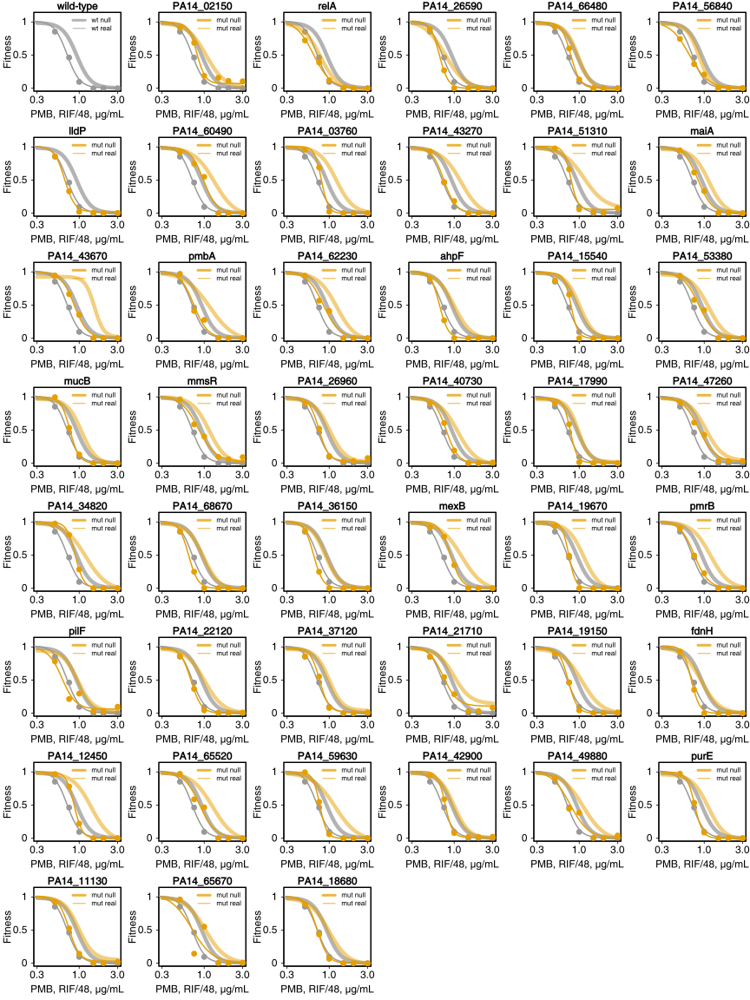
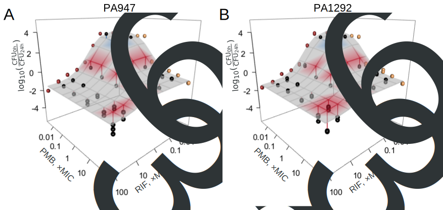

-   [Background](#background)
-   [Combinations](#combinations)
-   [pH effect on synergy](#ph-effect-on-synergy)
-   [pH effect on
    concentration-response](#ph-effect-on-concentration-response)
-   [PD parameters](#pd-parameters)
-   [Time-kill](#time-kill)
-   [Reverse Genetics Screen](#reverse-genetics-screen)
    -   [GO terms](#go-terms)
    -   [Protein-protein interaction
        network](#protein-protein-interaction-network)
-   [Screen Validation](#screen-validation)
    -   [Dose-response](#dose-response)
    -   [Compare to Loewe’s null](#compare-to-loewes-null)
    -   [Table with *E. coli* orthologs](#table-with-e.-coli-orthologs)
    -   [GO term table](#go-term-table)
-   [Selected five mutants](#selected-five-mutants)
    -   [3D](#d)
    -   [ROS production & lipid
        peroxidation](#ros-production-lipid-peroxidation)
    -   [Supplementary Membrane Assays](#supplementary-membrane-assays)
-   [PMB resistant isolates](#pmb-resistant-isolates)
-   [Change in EC90 of RIF](#change-in-ec90-of-rif)

# Background

We explored combination therapies of neglected and misused antibiotics.
The rifampin and polymyxin B combination emerged as a promising option
against various clinical isolates. This repository includes the data and
code to reproduce the analysis. For detailed figure captions and more
information, refer to the publication.

# Combinations

We studied the potential of the rifampicin-polymyxin B combination
against intra- and extracellular forms of bacteria: three *P.
aeruginosa* strains, two clinical isolates of *A. baumannii*, \_E. coli,
and *K. pneumoniae*.


# pH effect on synergy


# pH effect on concentration-response


# PD parameters


# Time-kill


# Reverse Genetics Screen

To account for the synergy in molecular terms—beyond a nonspecific
increase in membrane permeability by polymyxin B—we turned to chemical
genetics ([Brochado and Typas,
2013](https://doi.org/10.1016/j.mib.2013.01.008)). Working with ordered
PA14 transposon library ([Liberati et al.,
2006](https://doi.org/10.1073/pnas.0511100103)), we derived a growth
measure for monotherapies and combinations using colony opacity
([Kritikos et al., 2017](https://doi.org/10.1038/nmicrobiol.2017.14)).
To account for plate-to-plate variation, the opacity was
multiplicatively corrected. This results in zero-centering of the Bliss
scores, which were derived next. The significance of difference from
zero Bliss score, for any mutant, was estimated by a T-test (5
biological replicates) and corrected for multiple testing
(Benjamini-Hochberg).

Of the 70 hits, 53 are from mutant level of analysis and 17 come from
gene level of analysis. 31 are shared between mutants and genes
i.e. hits regardless if mutant or gene level of analysis is used.

<table>
<thead>
<tr class="header">
<th style="text-align: left;"><strong>LB</strong></th>
<th style="text-align: left;"><strong>LB pH 5.5</strong></th>
</tr>
</thead>
<tbody>
<tr class="odd">
<td style="text-align: left;"></td>
<td style="text-align: left;"></td>
</tr>
</tbody>
</table>

## GO terms

With the following, we bring some biological knowledge into the
analysis. This will get us at the level of processes/compartments as
opposed to individual genes. We will focus on LB beacuse we have more
data from there which is also more reliable (75% of the unique hits come
from LB; there is less variance). In addition, our results suggest, the
effect of pH on synergy is weak in PA14.

We did Gene Set Enrichment Analysis (GSEA) using GO terms from
[pseudomonas.com website](https://www.pseudomonas.com/) and
Kologorov-Smirnov testing for statistical significance estimation.
Although most common approach, it has been critizised for example
[here](https://www.ncbi.nlm.nih.gov/pmc/articles/PMC3134237/).

### Cell component

<table>
<colgroup>
<col style="width: 8%" />
<col style="width: 85%" />
<col style="width: 7%" />
</colgroup>
<thead>
<tr class="header">
<th style="text-align: left;">GO.ID</th>
<th style="text-align: left;">Term</th>
<th style="text-align: right;">Pvalue</th>
</tr>
</thead>
<tbody>
<tr class="odd">
<td style="text-align: left;">0008076</td>
<td style="text-align: left;">voltage-gated potassium channel
complex</td>
<td style="text-align: right;">0.011</td>
</tr>
<tr class="even">
<td style="text-align: left;">0055052</td>
<td style="text-align: left;">ATP-binding cassette (ABC) transporter
complex, substrate-binding subunit-containing</td>
<td style="text-align: right;">0.022</td>
</tr>
<tr class="odd">
<td style="text-align: left;">0005694</td>
<td style="text-align: left;">chromosome</td>
<td style="text-align: right;">0.036</td>
</tr>
<tr class="even">
<td style="text-align: left;">0033573</td>
<td style="text-align: left;">high-affinity iron permease complex</td>
<td style="text-align: right;">0.060</td>
</tr>
<tr class="odd">
<td style="text-align: left;">0005839</td>
<td style="text-align: left;">proteasome core complex</td>
<td style="text-align: right;">0.109</td>
</tr>
<tr class="even">
<td style="text-align: left;">0009289</td>
<td style="text-align: left;">pilus</td>
<td style="text-align: right;">0.121</td>
</tr>
<tr class="odd">
<td style="text-align: left;">0005960</td>
<td style="text-align: left;">glycine cleavage complex</td>
<td style="text-align: right;">0.146</td>
</tr>
<tr class="even">
<td style="text-align: left;">0030257</td>
<td style="text-align: left;">type III protein secretion system
complex</td>
<td style="text-align: right;">0.172</td>
</tr>
<tr class="odd">
<td style="text-align: left;">0005615</td>
<td style="text-align: left;">extracellular space</td>
<td style="text-align: right;">0.174</td>
</tr>
<tr class="even">
<td style="text-align: left;">0009380</td>
<td style="text-align: left;">excinuclease repair complex</td>
<td style="text-align: right;">0.178</td>
</tr>
</tbody>
</table>

### Biological process

<table>
<colgroup>
<col style="width: 11%" />
<col style="width: 78%" />
<col style="width: 10%" />
</colgroup>
<thead>
<tr class="header">
<th style="text-align: left;">GO.ID</th>
<th style="text-align: left;">Term</th>
<th style="text-align: right;">Pvalue</th>
</tr>
</thead>
<tbody>
<tr class="odd">
<td style="text-align: left;">0009236</td>
<td style="text-align: left;">cobalamin biosynthetic process</td>
<td style="text-align: right;">0.0085</td>
</tr>
<tr class="even">
<td style="text-align: left;">0009116</td>
<td style="text-align: left;">nucleoside metabolic process</td>
<td style="text-align: right;">0.0089</td>
</tr>
<tr class="odd">
<td style="text-align: left;">1900727</td>
<td style="text-align: left;">osmoregulated periplasmic glucan
biosynthetic process</td>
<td style="text-align: right;">0.0166</td>
</tr>
<tr class="even">
<td style="text-align: left;">0019700</td>
<td style="text-align: left;">organic phosphonate catabolic process</td>
<td style="text-align: right;">0.0172</td>
</tr>
<tr class="odd">
<td style="text-align: left;">0070475</td>
<td style="text-align: left;">rRNA base methylation</td>
<td style="text-align: right;">0.0178</td>
</tr>
<tr class="even">
<td style="text-align: left;">0044249</td>
<td style="text-align: left;">cellular biosynthetic process</td>
<td style="text-align: right;">0.0260</td>
</tr>
<tr class="odd">
<td style="text-align: left;">0019354</td>
<td style="text-align: left;">siroheme biosynthetic process</td>
<td style="text-align: right;">0.0296</td>
</tr>
<tr class="even">
<td style="text-align: left;">0006437</td>
<td style="text-align: left;">tyrosyl-tRNA aminoacylation</td>
<td style="text-align: right;">0.0346</td>
</tr>
<tr class="odd">
<td style="text-align: left;">0044262</td>
<td style="text-align: left;">cellular carbohydrate metabolic
process</td>
<td style="text-align: right;">0.0356</td>
</tr>
<tr class="even">
<td style="text-align: left;">0019748</td>
<td style="text-align: left;">secondary metabolic process</td>
<td style="text-align: right;">0.0371</td>
</tr>
</tbody>
</table>

## Protein-protein interaction network

Protein-protein interaction (PPI) analysis using STRING database. There
was no data on PA14, so we will use PAO1 data to build and analyse the
network onto which we then map PA14 orthologs.


The major graph communities, using (Newman-Girvan’s edge betweenness):

1.  The light blue nodes are central and seem to be enriched in
    regulatory genes.
2.  The grey nodes seem to be a signal transduction from membrane to the
    regulatory genes (in light blue).
3.  Orange and pink nodes are mostly related to metabolism; those in
    orange have more membrane related terms than the pink nodes.

# Screen Validation

We validate the sensitivity of identified candidate mutants in low
throughput and in liquid LB medium at pH 7.4. Instead of factorial (i.e.
checkerboard), we use a fixed ratio design [Tallarida et al
1997](https://doi.org/10.1016/s0024-3205(97)01030-8).

## Dose-response


## Compare to Loewe’s null



## Table with *E. coli* orthologs

<table>
<colgroup>
<col style="width: 8%" />
<col style="width: 13%" />
<col style="width: 8%" />
<col style="width: 69%" />
</colgroup>
<thead>
<tr class="header">
<th style="text-align: left;">PA gene</th>
<th style="text-align: left;">EC ortholog</th>
<th style="text-align: left;">Synergy</th>
<th style="text-align: left;">Description</th>
</tr>
</thead>
<tbody>
<tr class="odd">
<td style="text-align: left;">02150</td>
<td style="text-align: left;"></td>
<td style="text-align: left;">none</td>
<td style="text-align: left;">Serine phosphatase RsbU, regulator of
sigma subunit</td>
</tr>
<tr class="even">
<td style="text-align: left;">relA</td>
<td style="text-align: left;">relA</td>
<td style="text-align: left;">none</td>
<td style="text-align: left;">(p)ppGpp synthetase</td>
</tr>
<tr class="odd">
<td style="text-align: left;">26590</td>
<td style="text-align: left;"></td>
<td style="text-align: left;">none</td>
<td style="text-align: left;">GntR family transcriptional regulator</td>
</tr>
<tr class="even">
<td style="text-align: left;">66480</td>
<td style="text-align: left;"></td>
<td style="text-align: left;">less</td>
<td style="text-align: left;">Predicted ATPase involved in chromosome
partitioning</td>
</tr>
<tr class="odd">
<td style="text-align: left;">56840</td>
<td style="text-align: left;"></td>
<td style="text-align: left;">less</td>
<td style="text-align: left;">Predicted thiol oxidoreductase</td>
</tr>
<tr class="even">
<td style="text-align: left;">lldP</td>
<td style="text-align: left;">glcA</td>
<td style="text-align: left;">less</td>
<td style="text-align: left;">L-lactate permease</td>
</tr>
<tr class="odd">
<td style="text-align: left;">60490</td>
<td style="text-align: left;"></td>
<td style="text-align: left;">less</td>
<td style="text-align: left;">cytochrome c</td>
</tr>
<tr class="even">
<td style="text-align: left;">03760</td>
<td style="text-align: left;"></td>
<td style="text-align: left;">more</td>
<td style="text-align: left;">sodium:solute symporter</td>
</tr>
<tr class="odd">
<td style="text-align: left;">43270</td>
<td style="text-align: left;">selU</td>
<td style="text-align: left;">more</td>
<td style="text-align: left;">tRNA 2-selenouridine synthase</td>
</tr>
<tr class="even">
<td style="text-align: left;">51310</td>
<td style="text-align: left;"></td>
<td style="text-align: left;">more</td>
<td style="text-align: left;">Predicted redox protein, regulator of
disulfide bond formation</td>
</tr>
<tr class="odd">
<td style="text-align: left;">maiA</td>
<td style="text-align: left;"></td>
<td style="text-align: left;">more</td>
<td style="text-align: left;">maleylacetoacetate isomerase</td>
</tr>
<tr class="even">
<td style="text-align: left;">43670</td>
<td style="text-align: left;"></td>
<td style="text-align: left;">more</td>
<td style="text-align: left;">sensor/response regulator hybrid</td>
</tr>
<tr class="odd">
<td style="text-align: left;">pmbA</td>
<td style="text-align: left;">pmbA</td>
<td style="text-align: left;">more</td>
<td style="text-align: left;">PmbA protein</td>
</tr>
<tr class="even">
<td style="text-align: left;">62230</td>
<td style="text-align: left;"></td>
<td style="text-align: left;">more</td>
<td style="text-align: left;">Predicted kinase</td>
</tr>
</tbody>
</table>

## GO term table

<table>
<colgroup>
<col style="width: 7%" />
<col style="width: 9%" />
<col style="width: 40%" />
<col style="width: 41%" />
</colgroup>
<thead>
<tr class="header">
<th style="text-align: left;">PA gene</th>
<th style="text-align: left;">Location</th>
<th style="text-align: left;">Process</th>
<th style="text-align: left;">Function</th>
</tr>
</thead>
<tbody>
<tr class="odd">
<td style="text-align: left;">02150</td>
<td style="text-align: left;">membrane</td>
<td style="text-align: left;">signal transduction</td>
<td style="text-align: left;">catalytic</td>
</tr>
<tr class="even">
<td style="text-align: left;">03760</td>
<td style="text-align: left;">membrane</td>
<td style="text-align: left;">transmembrane transport</td>
<td style="text-align: left;">transmembrane transporter</td>
</tr>
<tr class="odd">
<td style="text-align: left;">26590</td>
<td style="text-align: left;">NA</td>
<td style="text-align: left;">regulation of transcription;
biosynthesis</td>
<td style="text-align: left;">catalytic; transcription factor</td>
</tr>
<tr class="even">
<td style="text-align: left;">43270</td>
<td style="text-align: left;">NA</td>
<td style="text-align: left;">tRNA seleno-modification</td>
<td style="text-align: left;">transferase for selenium-containing
groups</td>
</tr>
<tr class="odd">
<td style="text-align: left;">43670</td>
<td style="text-align: left;">membrane</td>
<td style="text-align: left;">signal transduction; phosphorylation</td>
<td style="text-align: left;">phosphorelay sensor kinase</td>
</tr>
<tr class="even">
<td style="text-align: left;">56840</td>
<td style="text-align: left;">NA</td>
<td style="text-align: left;">NA</td>
<td style="text-align: left;">electron transfer; heme binding</td>
</tr>
<tr class="odd">
<td style="text-align: left;">60490</td>
<td style="text-align: left;">NA</td>
<td style="text-align: left;">NA</td>
<td style="text-align: left;">electron transfer; heme binding</td>
</tr>
<tr class="even">
<td style="text-align: left;">lldP</td>
<td style="text-align: left;">membrane</td>
<td style="text-align: left;">lactate transport</td>
<td style="text-align: left;">lactate transmembrane transport</td>
</tr>
<tr class="odd">
<td style="text-align: left;">maiA</td>
<td style="text-align: left;">cytoplasm</td>
<td style="text-align: left;">aromatic amino acid metabolism</td>
<td style="text-align: left;">catalytic; protein binding</td>
</tr>
<tr class="even">
<td style="text-align: left;">pmbA</td>
<td style="text-align: left;">NA</td>
<td style="text-align: left;">peptidoglycan biosynthesis;
proteolysis</td>
<td style="text-align: left;">metallopeptidase</td>
</tr>
<tr class="odd">
<td style="text-align: left;">relA</td>
<td style="text-align: left;">NA</td>
<td style="text-align: left;">ppGpp metabolic process</td>
<td style="text-align: left;">NA</td>
</tr>
</tbody>
</table>

# Selected five mutants

## 3D


## ROS production & lipid peroxidation


<!--
## Membrane permeability


```
## $PmbConcMgL
## [1] 0.1
## 
## $RifConcMgL
## [1] 0
## 
## $Dunnett
## 
##   Dunnett's test for comparing several treatments with a control :  
##     95% family-wise confidence level
## 
## $`wild-type`
##                      diff     lwr.ci    upr.ci   pval    
## 66480-wild-type -2.106667 -6.2881962 2.0748629 0.4809    
## 02150-wild-type -3.770000 -7.9515296 0.4115296 0.0819 .  
## relA-wild-type  -1.123333 -5.3048629 3.0581962 0.8942    
## 26590-wild-type -1.423333 -5.6048629 2.7581962 0.7821    
## 43270-wild-type  3.376667 -0.8048629 7.5581962 0.1304    
## 
## ---
## Signif. codes:  0 '***' 0.001 '**' 0.01 '*' 0.05 '.' 0.1 ' ' 1
## 
## 
## $RobustDunnett
##  contrast            estimate   SE df t.ratio p.value
##  66480 - (wild-type)    -2.11 1.92 12  -1.098  0.6889
##  02150 - (wild-type)    -3.77 1.91 12  -1.974  0.2417
##  relA - (wild-type)     -1.12 3.01 12  -0.373  0.9773
##  26590 - (wild-type)    -1.42 1.92 12  -0.743  0.8698
##  43270 - (wild-type)     3.38 1.92 12   1.758  0.3293
## 
## P value adjustment: dunnettx method for 5 tests
```

```
## $PmbConcMgL
## [1] 2
## 
## $RifConcMgL
## [1] 0
## 
## $Dunnett
## 
##   Dunnett's test for comparing several treatments with a control :  
##     95% family-wise confidence level
## 
## $`wild-type`
##                       diff     lwr.ci      upr.ci    pval    
## 66480-wild-type  -7.536667 -16.605398   1.5320642  0.1162    
## 02150-wild-type  -9.753333 -18.822064  -0.6846025  0.0341 *  
## relA-wild-type  -25.990000 -35.058731 -16.9212692 2.2e-05 ***
## 26590-wild-type -29.013333 -38.082064 -19.9446025 5.3e-07 ***
## 43270-wild-type  10.973333   1.904602  20.0420642  0.0169 *  
## 
## ---
## Signif. codes:  0 '***' 0.001 '**' 0.01 '*' 0.05 '.' 0.1 ' ' 1
## 
## 
## $RobustDunnett
##  contrast            estimate   SE df t.ratio p.value
##  66480 - (wild-type)    -7.54 2.79 12  -2.704  0.0735
##  02150 - (wild-type)    -9.75 5.71 12  -1.708  0.3523
##  relA - (wild-type)    -25.99 3.07 12  -8.471  <.0001
##  26590 - (wild-type)   -29.01 2.14 12 -13.588  <.0001
##  43270 - (wild-type)    10.97 2.72 12   4.041  0.0069
## 
## P value adjustment: dunnettx method for 5 tests
```
-->

## Supplementary Membrane Assays


# PMB resistant isolates



# Change in EC90 of RIF


<!--

# Chloroquine


```
## 
## 1st model
##  fct:      LL.4(fixed = c(1, NA, NA, NA), names = c("slope", "Emax", "Emin", 
##  pmodels: 1 (for all parameters)
## 2nd model
##  fct:      LL.4(fixed = c(1, NA, NA, NA), names = c("slope", "Emax", "Emin", 
##  pmodels: chloroquine (for all parameters)
```

```
## ANOVA table
## 
##           ModelDf     RSS Df F value p value
## 2nd model      57 13.9989                   
## 1st model      54  4.1535  3  42.667   0.000
```

```
## 
## 1st model
##  fct:      LL.4(fixed = c(1, NA, NA, NA), names = c("slope", "Emax", "Emin", 
##  pmodels: 1 (for all parameters)
## 2nd model
##  fct:      LL.4(fixed = c(1, NA, NA, NA), names = c("slope", "Emax", "Emin", 
##  pmodels: chloroquine (for all parameters)
```

```
## ANOVA table
## 
##           ModelDf    RSS Df F value p value
## 2nd model      57 4.6767                   
## 1st model      54 3.3542  3  7.0966  0.0004
```

```
##        df      AIC
## m1_pmb  7 11.22562
## m2_pmb  4 25.16736
```

```
##        df      AIC
## m1_rif  7 24.04892
## m2_rif  4 90.95059
```

```
## 
## Model fitted: Log-logistic (ED50 as parameter) (3 parms)
## 
## Parameter estimates:
## 
##                   Estimate Std. Error  t-value   p-value    
## Emax:chloroquine -1.901870   0.098459 -19.3164 < 2.2e-16 ***
## Emax:control     -2.281402   0.086839 -26.2717 < 2.2e-16 ***
## Emin:chloroquine  3.509196   0.089456  39.2283 < 2.2e-16 ***
## Emin:control      3.629471   0.105448  34.4194 < 2.2e-16 ***
## IC50:chloroquine 12.196531   1.252178   9.7403 1.722e-13 ***
## IC50:control      4.557944   0.451625  10.0923 4.932e-14 ***
## ---
## Signif. codes:  0 '***' 0.001 '**' 0.01 '*' 0.05 '.' 0.1 ' ' 1
## 
## Residual standard error:
## 
##  0.2773383 (54 degrees of freedom)
```

```
## Estimate  p-value 
##  2.70000  0.00035
```

```
## Estimate  p-value 
##  0.83000  0.00017
```

```
## 
## Comparison of parameter 'Emax' 
## 
##                     Estimate Std. Error t-value   p-value    
## chloroquine/control 0.833641   0.041126 -4.0451 0.0001675 ***
## ---
## Signif. codes:  0 '***' 0.001 '**' 0.01 '*' 0.05 '.' 0.1 ' ' 1
```

```
## [1] 0.75 0.92
```

```
## 
## Estimated ratios of effect doses
## 
##                           Estimate Std. Error    t-value    p-value
## chloroquine/control:0/0 3.10350594 0.50911168 4.13171807 0.00012604
```

```
## [1] 2.1 4.1
```

```
## 
## Estimated effective doses
## 
##                 Estimate Std. Error    Lower    Upper
## e:chloroquine:0 22.50418    3.35270 15.78243 29.22593
## e:control:0      7.25121    0.49792  6.25295  8.24947
```

```
##                      2.5 %    97.5 %
## Emax:chloroquine -2.099268 -1.704472
## Emax:control     -2.455503 -2.107301
```

```
## 
## Model fitted: Log-logistic (ED50 as parameter) (3 parms)
## 
## Parameter estimates:
## 
##                   Estimate Std. Error  t-value   p-value    
## Emax:chloroquine -0.640179   0.081292  -7.8750 1.570e-10 ***
## Emax:control     -1.094442   0.080318 -13.6263 < 2.2e-16 ***
## Emin:chloroquine  3.530741   0.090245  39.1240 < 2.2e-16 ***
## Emin:control      3.575761   0.088856  40.2421 < 2.2e-16 ***
## IC50:chloroquine  0.770553   0.097517   7.9017 1.421e-10 ***
## IC50:control      0.773965   0.083207   9.3017 8.315e-13 ***
## ---
## Signif. codes:  0 '***' 0.001 '**' 0.01 '*' 0.05 '.' 0.1 ' ' 1
## 
## Residual standard error:
## 
##  0.2492302 (54 degrees of freedom)
```

```
## Estimate  p-value 
##     1.00     0.98
```

```
## Estimate  p-value 
##  5.8e-01  1.4e-05
```

```
## 
## Comparison of parameter 'Emax' 
## 
##                     Estimate Std. Error t-value   p-value    
## chloroquine/control 0.584936   0.087008 -4.7704 1.437e-05 ***
## ---
## Signif. codes:  0 '***' 0.001 '**' 0.01 '*' 0.05 '.' 0.1 ' ' 1
```

```
## [1] 0.4 0.8
```

```
## 
## Estimated ratios of effect doses
## 
##                         Estimate Std. Error  t-value  p-value
## chloroquine/control:0/0 1.680623   0.259976 2.618017 0.011452
```

```
## [1] 1.2 2.2
```

```
## 
## Estimated effective doses
## 
##                 Estimate Std. Error   Lower   Upper
## e:chloroquine:0  4.24979    0.47379 3.29989 5.19968
## e:control:0      2.52870    0.27117 1.98503 3.07237
```

```
##                       2.5 %     97.5 %
## Emax:chloroquine -0.8031596 -0.4771976
## Emax:control     -1.2554703 -0.9334134
```


-->

This repository is licensed under the MIT License - see the LICENSE file
for details.
